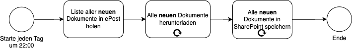
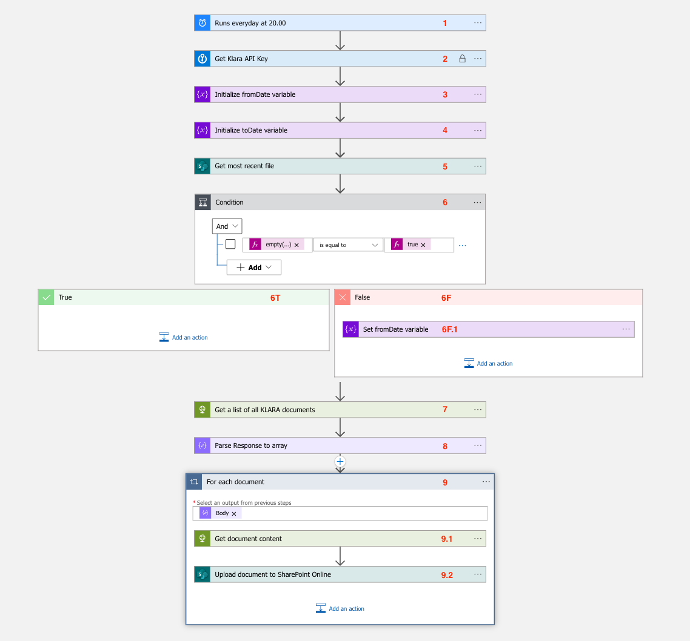
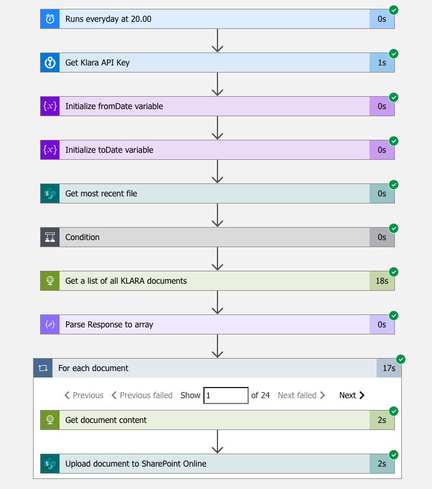
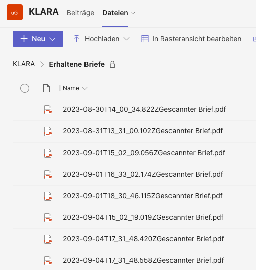

## Digitalisierung im Geschäftsalltag: Ein Leitfaden für Business Leader

In der heutigen, von Technologie durchdrungenen Welt ist die Digitalisierung von Geschäftsprozessen nicht mehr nur ein "Nice-to-have", sondern ein Muss. In diesem Artikel zeige ich dir, wie du mit modernen Tools wie ePost und Azure Logic Apps deine Geschäftsprozesse optimieren kannst.

### Warum Prozessdigitalisierung?

Der Fachkräftemangel ist eine wachsende Herausforderung. Hier kommt die Prozessdigitalisierung ins Spiel: Sie ermöglicht es Unternehmen, effizienter und wettbewerbsfähiger zu werden und den Mangel an qualifiziertem Personal zu kompensieren. Automatisierte Systeme, cloudbasierte Lösungen und innovative Algorithmen können Unternehmen dabei helfen, ihre Workflows zu optimieren.

### Ein praktisches Beispiel: ePost Digitalisierung

Bei unscripted nutzen wir das ePost Angebot der Schweizerischen Post. Dieses System ermöglicht es uns, physische Briefe digitalisieren zu lassen. Aber wie viele SaaS-Lösungen hat auch ePost seine Grenzen. Das Hauptproblem? Datensilos.

### Die Lösung: Integration mit Azure Logic Apps

Azure Logic Apps bietet eine No/Low-Code Plattform, die eine einfache Integration ermöglicht. Mit dieser Plattform können wir Daten aus ePost herunterladen und in unserer eigenen Datenablage speichern. 

## Umsetzung

### Prozess dokumentieren

Um den Prozess zu digitalisieren identifizieren wir die zu integrierenden Services: ePost und SharePoint (unsere Datenablage). Zur Viusalisierung habe ich den Prozess aufgezeichnet.

 

Um den Prozess noch effizienter zu gestalten, laden wir nur die neuen Dokumente aus ePost herunter, wie im nachfolgenden Prozess abgebildet.

 

### Prozess zur Implementierung

***Wenn du die technische Details überspringen möchtest, kannst du zum nächsten Abschnitt weitergehen.***

Um den Prozess in Azure Logic App abzubilden, nutzen wir die den Standard-Konnektor für SharePoint. Für ePost gibt es keinen Standard-Konnektor, hier müssen wir auf die API von ePost zugreifen.

In der öffentlich zugänglichen API [Dokumentation](https://api.klara.ch/docs#) der ePost (hier könnten sich einige SaaS Anbieter ein Beispiel nehmen) finden wir die benötigten API Endpoints `/epost/v2/letters` und `​/epost​/v2​/letters​/{letter-id}​/content`.

#### Nach neuen Dokumenten filtern

Wir filtern Dokumente nach Datum, um nur Neuzugänge herunterzuladen. Da die Azure Logic App keine Datenpersistenz hat, nutzen wir das Erstellungsdatum der neuesten Datei im Zielordner und setzen den Filter auf den folgenden Tag. Alternativen könnten wir auch Azure SQL, Blob Storage oder ein Textfile auf SharePoint hierfür verwenden.

#### Authentifizierung

Für die Authentifizierung in SharePoint nutzen wir den integrierten Azure Logic App Konnektor welcher OAuth verwendet. Ein spezifischer Benutzer mit eingeschränktem Zugriff wird empfohlen. Für die ePost API wird ein API-Schlüssel benötigt, den wir sicher in Azure Keyvault speichern. Die Authentifizierung für den Keyvault erfolgt über dessen Access Policies und die Managed Identity der Azure Logic App.

#### Azure Logic App Workflow

Jetzt können wir mit dem Azure Logic App Designer unseren Prozess digitalisieren! Wie dass aussieht siehst du in der nachfolgenden Abbildung.

 

Gehen wir die einzelnen Prozessschritte durch.

|Schritt|Typ|Beschreibung|
|---|---|---|
|1|Trigger|Täglicher Start um 22:00.|
|2|KeyVault Aktion|API Key für ePost API auslesen.|
|3|Variabel initialisieren|`fromDate` auf 1970-01-01 setzen.|
|4|Variabel initialisieren|`toDate` definieren (API benötigt es trotz Redundanz).|
|5|SharePoint Aktion|Neueste Dateien im Verzeichnis abrufen.|
|6|Conditional|Prüfung: Ist die Dateiliste leer?|
|6T|Conditional - True|Bei leerer Liste: Keine Aktion.|
|6F|Conditional - False|Aktionen für nicht-leere Liste.|
|6F.1|Conditional - False|`fromDate` auf Tag nach neuester Datei setzen.|
|7|HTTP Request|Dokumentenliste via `/epost/v2/letters` abrufen.|
|8|Parse JSON|Antwort zu JSON konvertieren.|
|9|For-each Schleife|Durch Dokumentenliste iterieren.|
|9.1|HTTP Request|Dokumentinhalt via `/epost​/v2​/letters​/{letter-id}​/content` abrufen.|
|9.2|SharePoint Aktion|Dokument in SharePoint mit Timestamp und Titel hochladen.|

#### Testlauf

Nach der Konfiguration des Workflows und der Authentifizierung können wir testen.
Im Screenshot ist zu sehen wie jeder Schritt erfolgreich durchläuft und die For-each Schleife 24-mal durchgeführt wird für 24 Dokumente.

 

## Resultat

Am Ende unserer Implementierung haben wir einen Ordner voller heruntergeladener Dokumente, die ohne ePost-Login zugänglich sind.

Allerdings tragen alle Briefe den gleichen Titel: "Gescannter Brief". Das macht die Identifizierung einzelner Dokumente schwierig, da wir jedes PDF öffnen müssen, um den Inhalt zu erkennen. Dies liegt an der Standardbenennung von ePost. Im nächsten Blog Post werden wir mithilfe von AI-Technologie eine Lösung für dieses Problem vorstellen.

 

## Fazit

Die Digitalisierung von Geschäftsprozessen ist mehr als nur ein Trend; sie ist eine Notwendigkeit. Mit den richtigen Tools und einem klaren Verständnis der zugrunde liegenden Prozesse kannst auch du die Vorteile der Digitalisierung nutzen.

So einen Prozess zu implementieren muss nicht kostspielig sein und kann schnell umgesetzt werden. Hast du in deinem Unternehmen ähnliche Herausforderungen? Schreib mir eine [Mail](mailto:loris@unscripted.ch) oder chatte mich an in [Microsoft Teams](https://link.unscripted.ch/teamschat_l).

**Im [zweiten Teil des Blogpost's](https://blog.unscripted.ch/post/epost-digitalisierung-2/) machen wir den Prozess "smart" in dem wir AI Services nutzen.**

