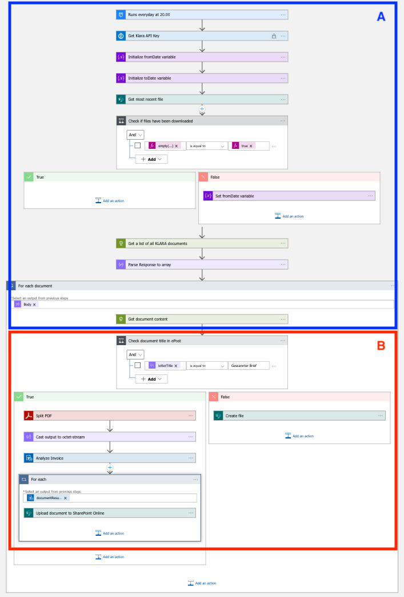
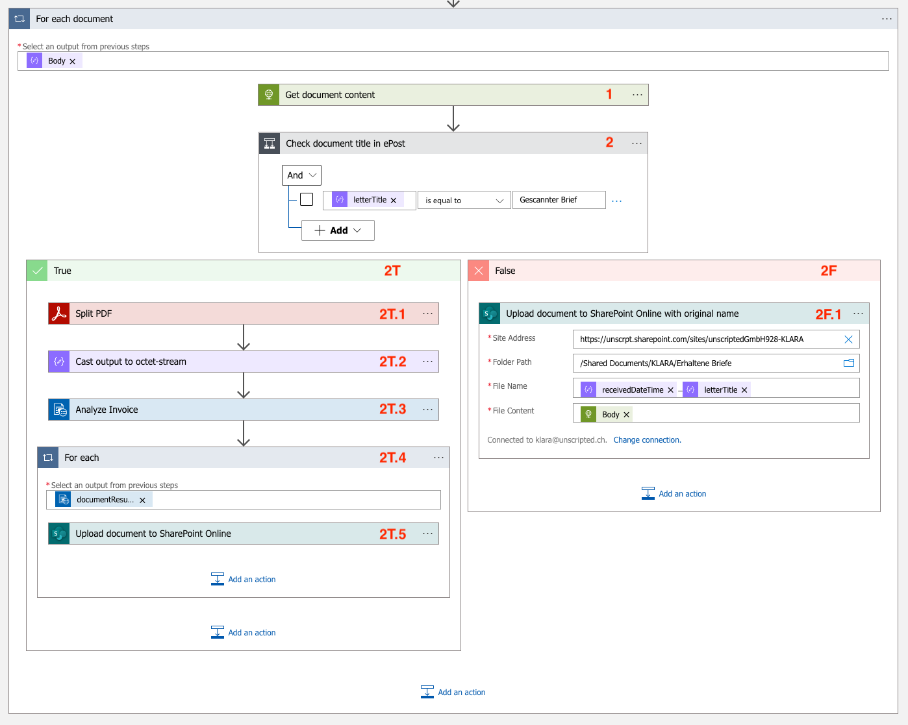
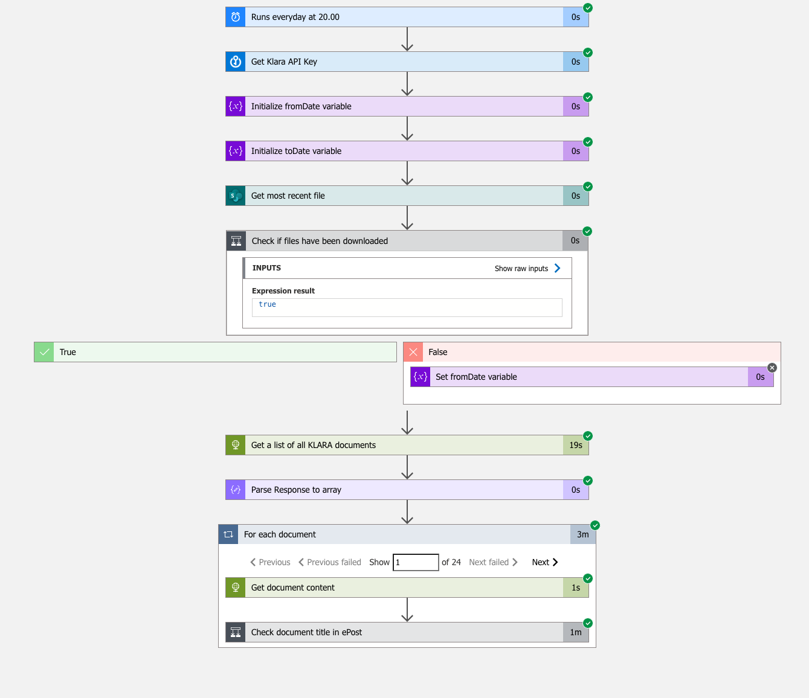
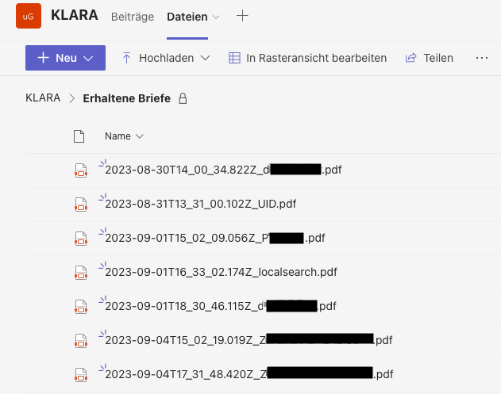

## Prozess-Digitalisierung: AI Services in unseren Geschäftsprozessen

Im letzten [Blog Beitrag](https://blog.unscripted.ch/post/epost-digitalisierung-1/) haben wir einen einen Workflow erstellt um Dateien von ePost in unsere SharePoint Ablage zu speichern. Leider gibt uns der ePost Service keine aussagekräftigen Namen für unsere Dateien. Das wollen wir in diesem Artikel verbesssern, in dem wir Azure AI Services verwenden.

### Was sind Azure AI Services?

Azure AI Services bietet eine Palette von AI-Diensten, einschliesslich Textgenerierung, Bildverarbeitung und Übersetzung. Ein Vorteil ist die Nutzung von Microsofts vortrainierten Modellen, wodurch eigenes Training für einfache Aufgaben entfällt.

In unserem Beispiel werden wir den Document intelligence Service verwenden, da dieser vortrainierte Modelle zur erkennung von Informationen in Dokumenten enthält.

## Integration in bestehenden Workflow

### Vorbereitung

Um den Document intelligence Service nutzen zu können müssen wir diesen zuerst in Azure erstellen. Nach der Erstellung haben wir einen API Endpoint und API-Schlüssel um den Service nutzen zu können.

Zusätzlich nutzen wir die Adobe PDF Services API, um PDFs anzupassen. Da Azure Document Intelligence nur Daten bis 4 MB akzeptiert und einige ePost-PDFs grösser sind, beschränken wir uns auf die ersten zwei Seiten. Dies spart auch Azure-Kosten, da pro Seite abgerechnet wird.

### Neuer Azure Logic App Workflow

Jetzt optimieren wir unseren Azure Logic App Workflow. Die Abbildung zeigt den aktualisierten Workflow: Teil A bleibt unverändert, während Teil B die AI integriert.

Schauen wir uns nun den Teil B genauer an.

|Schritt|Typ|Beschreibung|
|---|---|---|
|1|HTTP Request|Dokumentinhalt via `/epost​/v2​/letters​/{letter-id}​/content` abrufen.|
|2|Conditional|Prüfung: Ist der Dateinname "Gescannter Brief"?|
|2F|Conditional - False|Aktionen wenn Dateinname nicht "Gescannter Brief" ist|
|2F.1|Conditional - False|Dokument in SharePoint mit Timestamp und Titel hochladen.|
|2T|Conditional - True|Aktionen wenn Dateinname "Gescannter Brief" ist|
|2T.1|Conditional - True|PDF auf 2 Seiten reduzieren|
|2T.2|Conditional - True|Datentyp des reduzierten PDF's ändern|
|2T.3|Conditional - True|PDF mit Document intelligence analysieren lassen|
|2T.4|Conditional - True / For-each Schleife|Über Resultat der Document intelligence Analyse iterieren|
|2T.5|Conditional - True|Dokument in SharePoint mit Timestamp und Versendername hochladen.|

### Testlauf

Jetzt testen wir unseren neuen Workflow! Der Screenshot zeigt, dass alle Schritte erfolgreich durchgeführt wurden. Die For-each Document Schleife dauert nun drei Minuten statt 17 Sekunden, hauptsächlich wegen der AI-Analyse und des API-Ratelimits.

 

## Resultat

Die Daten im Zielordner sind nun mit den Absendernamen betitelt (Namen zensiert, unerwünschte Werbung sichtbar). Der Screenshot zeigt auch einen Fehler: Der "UID"-Brief stammt vom Bundesamt für Statistik. Bei 24 Dokumenten gab es zwei falsche und zwei unzureichende Titel, was einer Fehlerquote von 17% entspricht. Dies ist für uns akzeptabel, wir können die fehlerhaften und unzureichenden Titel manuell korrigieren. Um eine bessere Quote zu erhalten, könnten wir ein eigenes Modell trainieren, benötigen jedoch mehr Daten.

 

## Fazit

Durch die Integration von AI in unserem Azure Logic App Workflow haben wir die Dokumentenverwaltung deutlich optimiert. Die AI ermöglicht nicht nur eine intelligentere Benennung, sondern bietet auch Potenzial für die Erkennung von Rechnungstypen, Beträgen und visuellen Inhalten. Zudem erlaubt Azure die Möglichkeit, eigene Modelle zu trainieren, um spezifische Anforderungen zu erfüllen. Dies zeigt, wie vielfältig und anpassbar AI in der Digitalisierung ist.

**Möchtest du das volle Potenzial von AI für dein Unternehmen nutzen?** Starte jetzt einen Ideation Workshop mit uns und entdecke massgeschneiderte AI-Anwendungsfälle für dein Business! [Kontaktiere](mailto:ai@thermic.ch) uns oder vereinbare einen [introduction call](https://link.unscripted.ch/l-ai-workshop-intro) und setze den ersten Schritt in eine digitalisierte Zukunft.